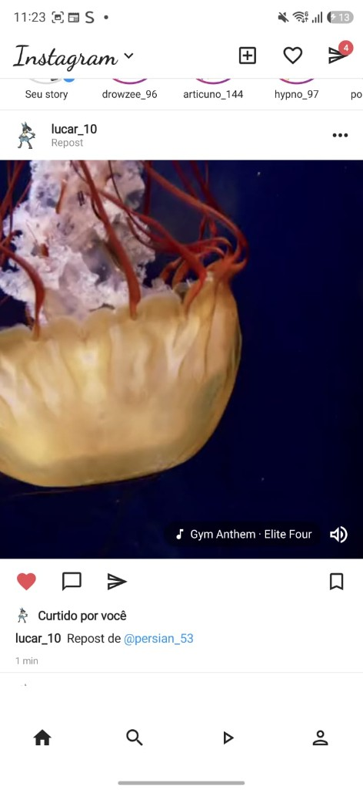
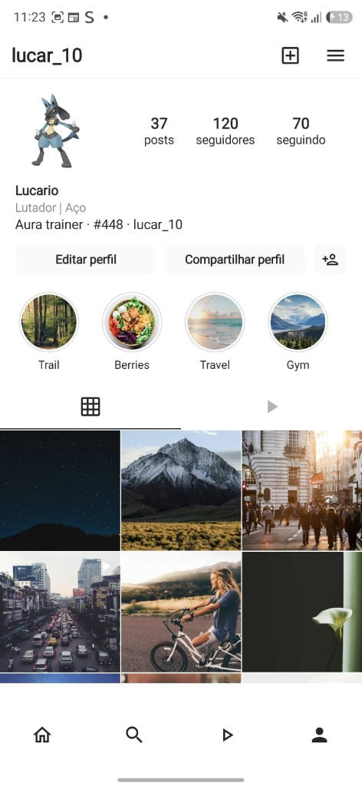
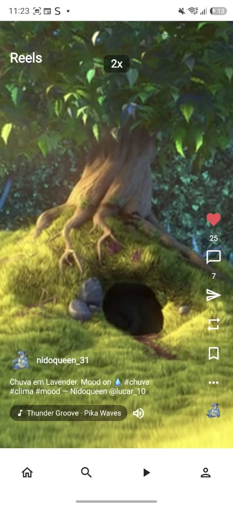
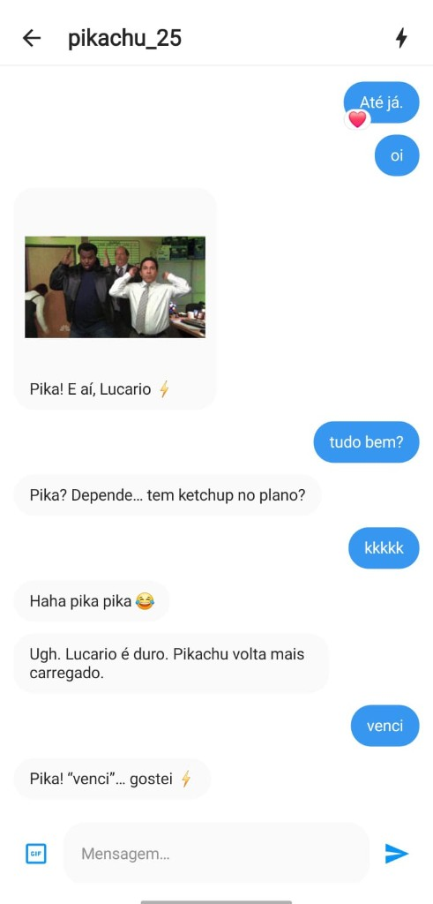
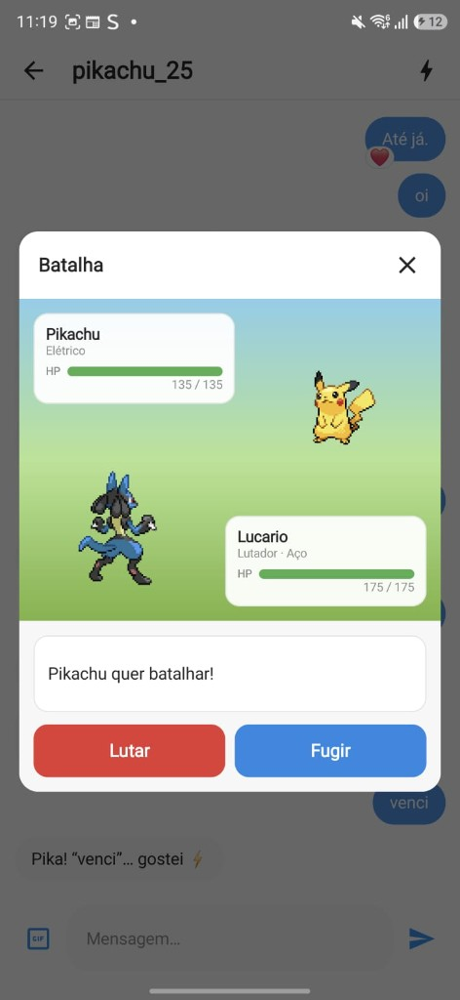
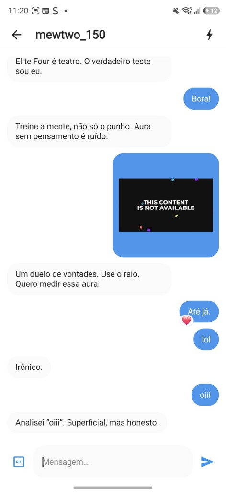

# PokeSocial

Rede social no estilo Instagram, feita em **Kotlin + Jetpack Compose**, onde você é o **Lucario** (`@lucar_10`) e o feed é povoado pela Gen 1 da [PokeAPI](https://pokeapi.co/).

Na primeira abertura o app baixa a Pokédex, persiste tudo no **Room** e gera posts, stories, comentários, curtidas, músicas e conversas com mídia local. Depois disso funciona offline.

---

## Screenshots

| Feed | Perfil | Reels |
|:---:|:---:|:---:|
|  |  |  |

| Chat | Batalha no DM | Chat (Mewtwo) |
|:---:|:---:|:---:|
|  |  |  |

---

## Destaques

| Área | O que faz |
|------|-----------|
| **Feed** | Stories, likes reais, zoom em fotos, música, menções, repost, bookmark |
| **Explore** | Grade e busca por hashtag |
| **Reels** | Player Media3, hold nos cantos = 2x, repost e share via DM |
| **Inbox** | DMs com GIFs, reações, respostas automáticas e mini-batalha |
| **Perfil** | Lucario (#448), highlights, grid e lista de seguidores |
| **Curtidas** | Contagem real + tela com quem curtiu |
| **UI** | Chrome inspirado no Instagram (header, stories, reels) |

Usuário fixo: **`lucar_10`** · Lucario · Pokémon #448

---

## Stack

- **UI:** Jetpack Compose + Material 3 + Navigation
- **Arquitetura:** MVVM + repository
- **Local:** Room (KSP) + assets de mídia
- **Rede:** Retrofit + Moshi (PokeAPI — avatares)
- **Imagens:** Coil
- **Vídeo:** Media3 ExoPlayer

**Requisitos:** Android 8.0+ (API 26) · internet na 1ª abertura (PokeAPI)

---

## Como rodar

```bash
./gradlew :app:installDebug
adb shell am start -n com.pokesocial.app/.MainActivity
```

Para forçar reseed (limpar dados):

```bash
adb shell pm clear com.pokesocial.app
adb shell am start -n com.pokesocial.app/.MainActivity
```

Build release:

```bash
./gradlew :app:assembleRelease
# APK em app/build/outputs/apk/release/
```

---

## Versão

| Campo | Valor |
|-------|--------|
| `versionName` | **2.0** |
| `versionCode` | 2 |
| `applicationId` | `com.pokesocial.app` |

Notas de versão: [CHANGELOG.md](./CHANGELOG.md) · [Releases no GitHub](https://github.com/pedrogribas/poke-social/releases)

---

## Estrutura (resumo)

```
app/src/main/java/com/pokesocial/app/
├── core/           # constantes, mídia local, chat brain, batalha
├── data/
│   ├── local/      # Room + SeedManager + ContentThemes
│   ├── remote/     # PokeAPI (Retrofit)
│   └── repository/ # SocialRepository
├── domain/model/   # User, Post, Story, Chat…
└── ui/             # feed, explore, reels, chat, profile, stories…
```

---

## Aviso

Projeto **educacional / demonstração**. Não afiliado à Nintendo, The Pokémon Company ou Meta. Sprites e nomes de Pokémon vêm da PokeAPI; fotos/vídeos de posts usam assets empacotados e amostras públicas.
